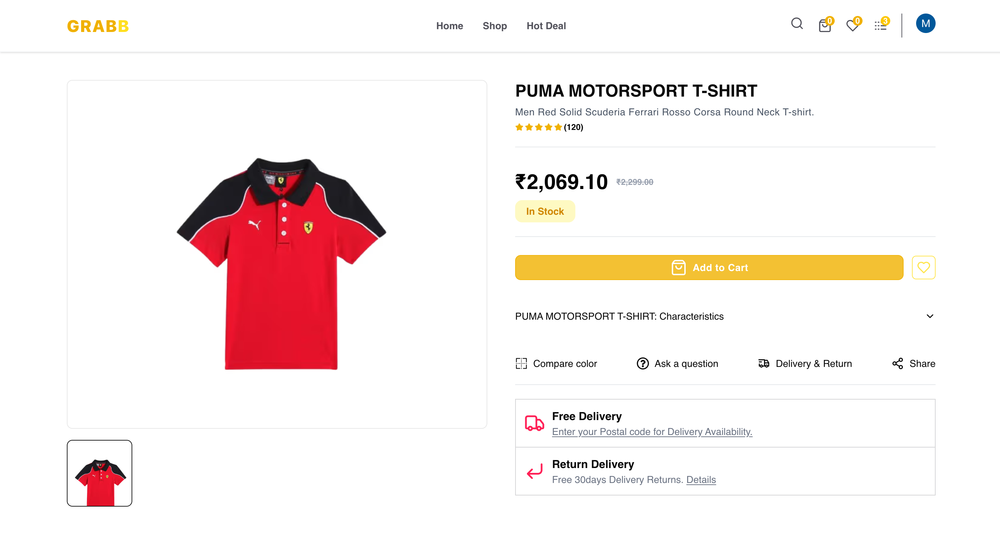
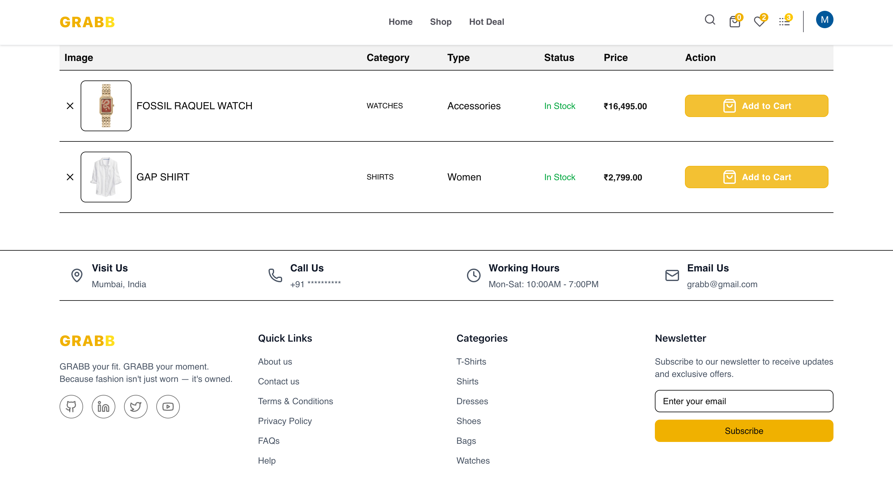
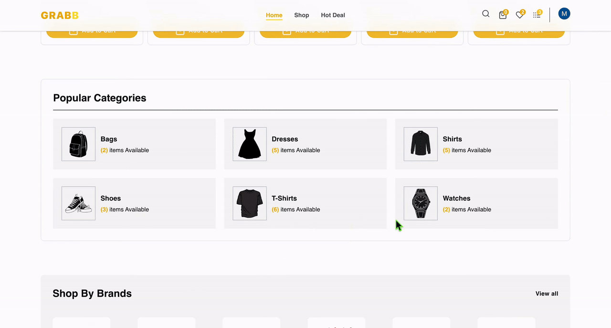
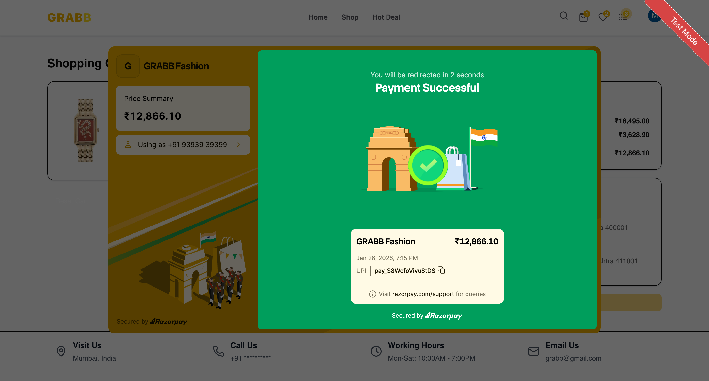
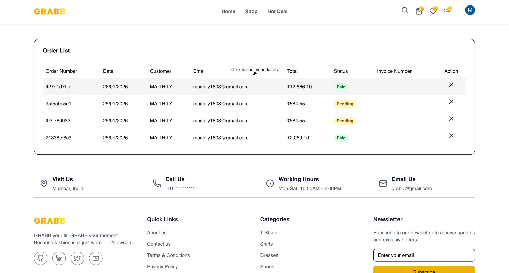
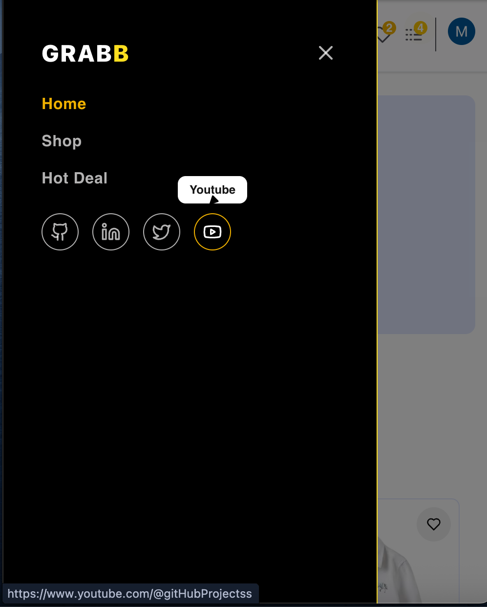
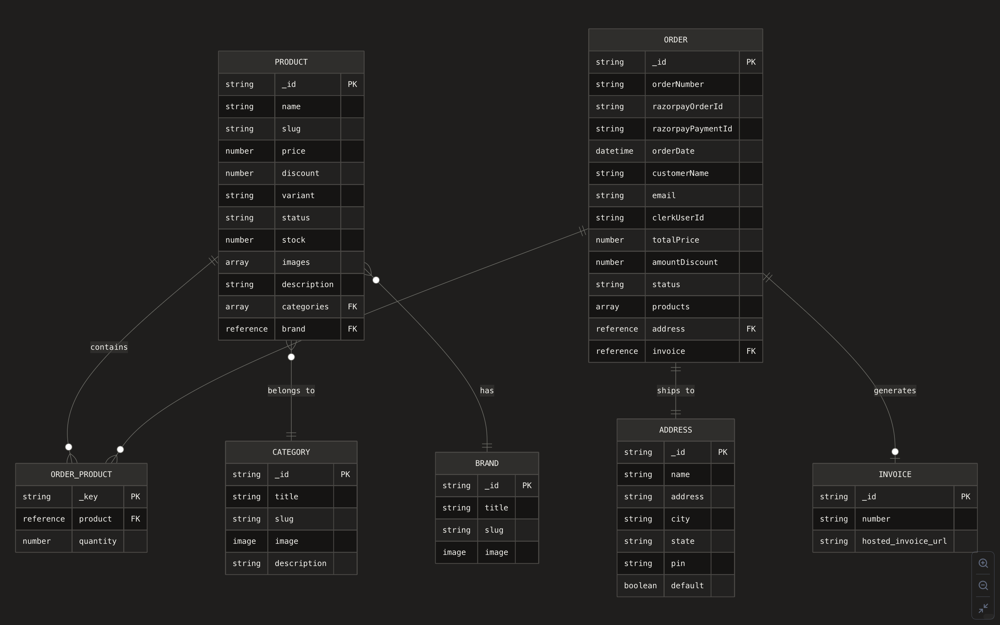

# 

### **`GRABB your fit. GRABB your moment. Because fashion isn't just worn - it's owned.`**

---

## 🧩 Homepage 

  

## 🎬 Product Tour

  
<strong>Product page</strong>

   
  

    
  

  
<strong> Searching a product </strong>

   
  

    
  

  
<strong>Wishlist page</strong>

   
  

    
  

  
<strong> Product filtering </strong>

   
  

    
  

  
<strong> Add to cart </strong>

   
  

    
  

  
<strong> Checkout page </strong>

   
  

    
  

  
<strong>Orders page</strong>

   
  

    
  

  
<strong>Mobile View</strong>

   
  

    
  

---
## ✨ Features

- **`Smart Shopping Cart`**  
  Persistent cart with quantity management using global state.

- **`CMS Powered Content`**  
  Real-time product & category management using Sanity Studio.

- **`Advanced Search`**  
  Real-time product search with instant suggestions.

- **`Seamless Payments`**  
  Razorpay integration for secure checkout flow.

-----

  ## ⚙️ System Breakdown

  
<strong> Sanity Setup </strong>

   
  

    
  

  

  
<strong> Architecture </strong>

   
  

    
  

  
<strong> Workflow </strong>

   
  

    
  

---
## 🛠️ Built with

  
  
  
  
  

  
  
  
  

---
## 👀 Explore GRABB. Own your style. ⭐ if you love it.
**`Made with ❤️ and ☕`**
